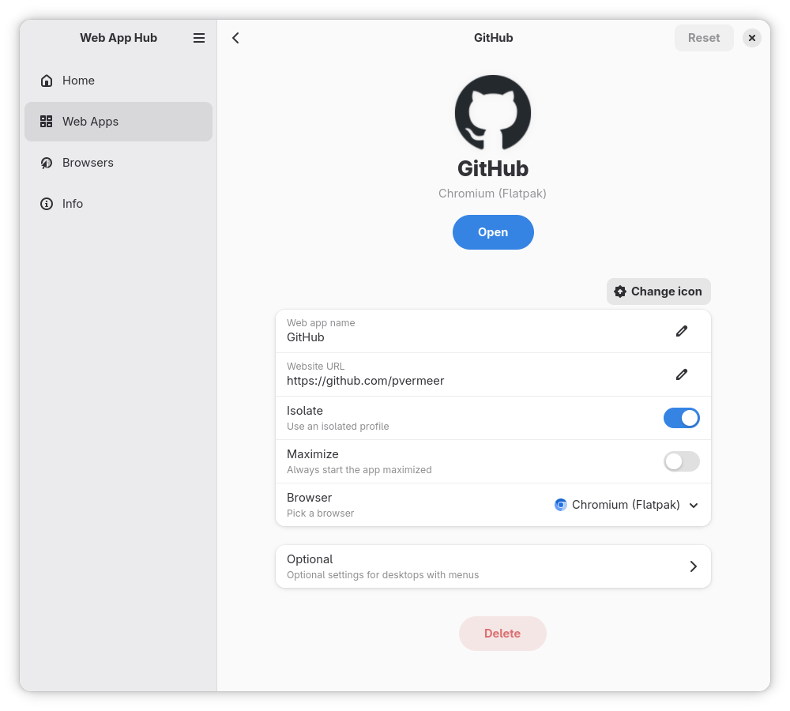

# Web App Hub

A modern Web App Manager built with Rust, GTK, and the Adwaita design language. Web App Hub enables seamless management of web applications, each with its own icon and isolated browser profile.

[](https://flathub.org/apps/org.pvermeer.WebAppHub)

## Features

- Seamless browser switching between all installed browsers
- Leverages your existing browser installations
- Profile isolation for enhanced privacy and organization
- Dedicated icons and dock indicators for each web application
- Extensible configuration system via YAML and desktop files



## Custom Browser Configuration

### Configuration Location

Browser configurations are located at:
```
~/.var/app/org.pvermeer.WebAppHub/config/web-app-hub
```

Default browser configurations are read-only and reset on application startup. To add custom browsers, create new configuration files in the appropriate directories. Example configurations are available in `assets/config`.

### Browser Config File

Create a `.yml` file in the `browsers` directory:

```yaml
name: Chromium
flatpak: org.chromium.Chromium          # Optional: Flatpak app ID
system_bin: chromium-browser            # Optional: System binary path
can_isolate: true                       # Supports profile isolation
can_start_maximized: true               # Supports maximized launch
desktop_file_name_prefix: org.chromium.Chromium.chromium
base: chromium                          # Base browser type: chromium or firefox
issues:                                 # Optional: Known limitations
  - Does not remember window size and position
```

### Desktop File

Create a matching `.desktop` file in the `desktop-files` directory:

```desktop
[Desktop Entry]
Version=1.0
Type=Application
Terminal=false
Name=%{name}
Exec=%{command} --no-first-run --app="%{url}" --class=chrome-%{domain_path}-Default --name=chrome-%{domain_path}-Default %{is_isolated ? --user-data-dir} %{is_maximized ? --start-maximized}
X-MultipleArgs=false
Icon=%{icon}
StartupWMClass=chrome-%{domain_path}-Default
```

### Template Variables

The desktop file supports variable substitution using the `%{variable}` syntax.

#### Standard Variables

| Variable | Description |
|----------|-------------|
| `%{command}` | Browser launch command (Flatpak or system binary) |
| `%{name}` | Web application name |
| `%{url}` | Complete application URL |
| `%{domain}` | Domain portion of the URL |
| `%{domain_path}` | Sanitized domain and path combination |
| `%{icon}` | Path to the application icon |
| `%{app_id}` | Generated application identifier |

#### Conditional Variables

Conditional variables use the syntax `%{condition ? value}` and are only included when the condition is met.

| Conditional | Description |
|-------------|-------------|
| `%{is_isolated ? --flag}` | Expands to `--flag=<profile-path>` when profile isolation is enabled |
| `%{is_maximized ? --flag}` | Expands to `--flag` when start maximized is enabled |

### Profile Extras

The `profiles` directory can contain browser-specific subdirectories with additional files to be copied into isolated browser profiles.

**Directory structure:**
```
profiles/
├── firefox/          # Applied to all Firefox-based browsers
├── chromium/         # Applied to all Chromium-based browsers
└── brave/            # Applied only to Brave browser
```

**Important:** Base type (firefox/chromium) is only used if there is no specific browser configuration folder. Browser-specific folders take precedence over base type folders.

## Building from Source

```sh
cargo build
```

**Flatpak:**

```sh
./flatpak/build.sh
```

## License

This project is licensed under the GPL-3.0 License. See the [LICENSE](LICENSE) file for details.
